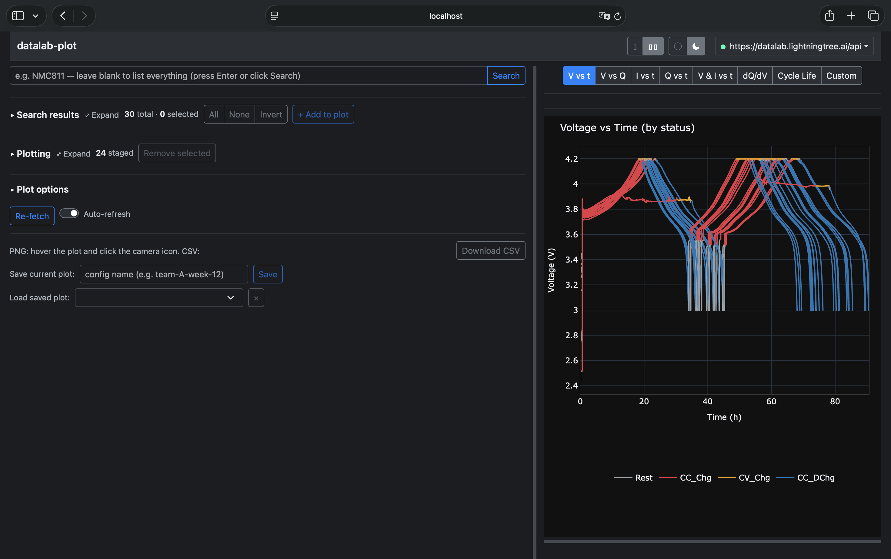

<p align="center">
  
</p>

Plot electrochemistry data from a [datalab](https://docs.datalab-org.io) instance
locally — without going through the webapp. Multi-cell cycling comparisons,
single-cell deep dives, NMR / XRD / UV-Vis. Three user surfaces:

- **Web GUI** — `datalab-plot gui` opens a browser tab on a Dash app:
  search, stage cells, pick a plot mode, zoom and pan with Plotly. Light /
  dark themes; one- or two-column layout.
- **Python API** — `from datalab_plot import plot_cycles, plot_cell, find_cells, …`
  returning `matplotlib.figure.Figure` for scripts and notebooks.
- **CLI** — `datalab-plot list / cycle / cell / nmr / xrd / uvvis` for one-shot
  PNG exports.

<p align="center">
  
</p>

## Quickstart

Three commands from a cold machine to the web UI. Works on macOS, Linux,
and Windows. You'll need a datalab instance URL and a personal API token
(get one at `<DATALAB_URL>/get-api-key`).

### 1 · Install `uv`

[`uv`](https://docs.astral.sh/uv/) fetches the right Python for you — no
separate Python install needed.

**macOS / Linux:**
```bash
curl -LsSf https://astral.sh/uv/install.sh | sh
```

**Windows PowerShell:**
```powershell
powershell -ExecutionPolicy ByPass -c "irm https://astral.sh/uv/install.ps1 | iex"
```

Restart your terminal so `uv` is on `PATH`. Already have `uv`? Skip ahead.

### 2 · Install `datalab-plot`

From any directory you want the project's environment to live in (e.g.
your home dir). The two commands below are identical on all OSes:

> If your shell prompt shows `(base)` or another conda environment name,
> run `conda deactivate` first. An active conda env with a non-3.12
> Python can shadow `uv`'s own interpreter and cause the next two
> commands to fail with confusing import / version errors.
>
> Also, the second command fetches from a `git+https://...` URL so it needs
> `git` on PATH. Run `git --version` first; if it errors, install Git from
> [git-scm.com](https://git-scm.com/downloads) (Windows users most often
> need this).

```bash
uv venv --python 3.12
uv pip install "datalab-plot[gui,picker] @ git+https://github.com/lightningtree-ai/datalab-plot"
```

`uv` downloads Python 3.12 if you don't already have it, creates `.venv/`
next to you, and installs `datalab-plot` plus the GUI/Jupyter extras.

### 3 · Launch the web UI

```bash
uv run datalab-plot gui
```

`uv run` finds the `.venv` automatically — no activation needed. Your
browser opens to `http://localhost:8501`. Click **Connect** in the top
right, paste your API key → search → tick rows → **+ Add to plot** →
pick a plot mode on the right.

> Run subsequent commands from the same directory so `uv run` finds the
> venv, or activate it once with `source .venv/bin/activate`
> (macOS/Linux) or `.venv\Scripts\Activate.ps1` (Windows) and drop the
> `uv run` prefix.

See [Install](#install) below for the repo-clone setup, `pip`-only
install, and troubleshooting.

---

## Configuration

| Env var            | What it is                                    |
|--------------------|-----------------------------------------------|
| `DATALAB_URL`      | Base URL of your instance                     |
| `DATALAB_API_KEY`  | Personal API token, from `<URL>/get-api-key`  |

Both are read at runtime. The GUI prompts for the key interactively if it
isn't in the environment; the library + CLI raise a clear error if either
is missing.

The GUI also **remembers the key** after a successful connection: it
saves it per-instance-URL to `credentials.json` in the platform
user-config directory (owner-only file permissions), so you don't have
to paste it in every restart. Use *Forget saved key* in the navbar's
connected-status dropdown to clear it.

`DATALAB_PLOT_CACHE` (optional) overrides the local file cache directory.
Default: `./cache/datalab_plot/` when run from a repo checkout, otherwise
the platform user cache (e.g. `~/.cache/datalab-plot/` on Linux).

## Web GUI

```bash
datalab-plot gui                  # http://localhost:8501
datalab-plot gui --port 9000      # custom port
datalab-plot gui --no-browser     # start server without opening a tab
```

The layout is two columns under a navbar. The left column holds the data
workflow (search → results → staging → options → export); the right
column holds the preset selector and the plot. A draggable vertical
divider sets the split; the navbar has toggles for one-/two-column
layout and light/dark theme. The connected-status item in the navbar
also exposes cache stats and *Forget cached data / Forget saved key /
Sign out*.

Typical flow:

1. **Connect.** Click *Connect* (top right). The modal pre-fills the URL
   if you've connected before — paste your API key and *Connect*. On
   first launch the app auto-connects using a saved key or the
   `DATALAB_API_KEY` env var if present.
2. **Search.** Free-text query (e.g. `NMC811`) or leave blank to list
   everything. The 30 most-recent items load automatically on first
   connect so you can skip this for a quick browse.
3. **Stage.** Tick rows in **Search results** and click *+ Add to plot*.
   The selected rows move to the durable **Plotting** table, where the
   `label`, `group`, and `color` columns are editable. Cells sharing a
   `group` get the same perceptually uniform colormap. The
   apply-to-selection toolbar bulk-fills those columns across selected
   rows.
4. **Plot.** Pick a preset on the right — *V vs t*, *V vs Q*, *dQ/dV*,
   *Cycle Life*, etc. **Cycle Life** exposes a sub-view selector
   (*Discharge* / *Charge* / *CE %* / *Table*). With *Auto-refresh* on
   (default) the plot live-updates whenever the staged set or options
   change. *Re-fetch* purges the on-disk cache for the staged cells and
   re-downloads. Plot dimensions are draggable (horizontal handle for
   height, the column divider for width) and exposed as **X / Y px**
   fields in Plot options.
5. **Export.** Plotly's modebar camera icon saves a PNG; *Download CSV*
   exports the plotted data; *Save* / *Load* persist the staged set + all
   plot options as a JSON config under your cache directory.

If a cell's file can't be parsed (e.g. malformed cycler export), that
row is auto-deselected and an error banner explains why.

### Plotting local files (no datalab needed)

The Connect modal has a **Local folder** tab: pick a folder with
*Browse…* (or type its path) and click *Open folder*. The app
recursively lists every cycler export it finds (Biologic `.mpr`,
Neware `.nda`/`.ndax`, Arbin `.res`, `.xls`/`.xlsx`, `.csv`, `.txt`)
— one file per row — and the rest of the workflow is identical:
filter by filename in the search box, stage, and plot. Your data
files are read in place and never modified, copied, or deleted. The
last opened folder is remembered and pre-filled on the next launch
(`DATALAB_PLOT_LOCAL_DIR` serves as the fallback). Notes:

- A session is either datalab **or** a local folder — *Close folder*
  (in the navbar dropdown) to switch.
- Bare files carry no cell metadata, so the electrode / mass columns
  are empty and *specific capacity* is unavailable (the plot warns
  "no cathode mass recorded").
- *Re-fetch* re-parses the files from disk — useful while a cycler is
  still appending data to an export.

## Python API

### Discovery

```python
from datalab_plot import find_cells

df = find_cells(query="NMC811", limit=50)        # → pandas DataFrame
# columns: item_id, name, refcode, type, chemform,
#          positive_electrode, negative_electrode, electrolyte,
#          last_modified, collections
```

### Multi-cell comparison

```python
from datalab_plot import plot_cycles, DatalabPlotClient

with DatalabPlotClient() as client:
    fig = plot_cycles(
        ["XXKSRF", "SJMSEL", "TNDKZB"],          # or a {label: item_id} dict
        mode="summary",
        client=client,
    )

    # All cycles per cell, each cell a different perceptually uniform colormap
    fig = plot_cycles(["XXKSRF", "TNDKZB"], mode="voltage_capacity", client=client)

    # dQ/dV overlay at a specific cycle
    fig = plot_cycles(["XXKSRF", "TNDKZB"], mode="dqdv", cycle=1, client=client)

    # V vs cumulative time
    fig = plot_cycles(["XXKSRF", "TNDKZB"], mode="voltage_time", client=client)
```

The `items` argument accepts three shapes — bare list, `{label: item_id}`
dict, or `{label: {item_id, group?, color?}}` — depending on how much
control over the legend / colour scheme you want.

### Single cell

```python
from datalab_plot import plot_cell

plot_cell("XXKSRF", mode="voltage_capacity")     # V-Q, cycles coloured viridis
plot_cell("XXKSRF", mode="voltage_time")
plot_cell("XXKSRF", mode="dqdv", cycles=[1, 5, 20])
plot_cell("XXKSRF", mode="summary")
```

### Other techniques

```python
from datalab_plot import plot_nmr, plot_xrd, plot_uvvis

plot_nmr("nmr_item_id")          # Bruker .zip or JCAMP-DX
plot_xrd("xrd_item_id")          # .xy, .xye, .dat, .xrdml
plot_uvvis("uvvis_item_id")      # .txt (first file = reference)
```

### Plot-mode summary

| Mode               | `plot_cycles` (multi-cell)                          | `plot_cell` (single)                              |
|--------------------|-----------------------------------------------------|---------------------------------------------------|
| `summary`          | Discharge capacity + CE vs cycle                    | Same, one cell                                    |
| `voltage_time`     | V vs cumulative time, one trace per cell            | V vs time, all cycles                             |
| `voltage_capacity` | All cycles per cell, per-cell colormap              | V-Q with cycles coloured viridis                  |
| `dqdv`             | dQ/dV at chosen `cycle=N`, one trace per cell       | dQ/dV per chosen `cycles=[…]`, coloured by cycle  |

## CLI

```bash
datalab-plot list --query NMC811
datalab-plot cycle XXKSRF SJMSEL TNDKZB --mode summary --out s.png
datalab-plot cycle XXKSRF SJMSEL --mode dqdv --cycle 1 --out dqdv.png
datalab-plot cell XXKSRF --mode voltage_capacity --out cell.png
datalab-plot nmr <item_id> --out nmr.png
datalab-plot gui
```

`datalab-plot --help` and `datalab-plot <subcommand> --help` print everything.

## Install

The [Quickstart](#quickstart) covers the common path (`uv` + no clone +
GUI). The variants below are for everyone else.

### Clone the repo

Pick this if you want the starter notebook to hand or might tweak the
code.

```bash
git clone https://github.com/lightningtree-ai/datalab-plot
cd datalab-plot
uv sync --extra gui --extra picker
```

`uv sync` creates `.venv/` in the repo on Python 3.12 and installs
everything from `pyproject.toml`. Activate the venv
(`source .venv/bin/activate` / `.venv\Scripts\Activate.ps1`) or prefix
commands with `uv run`.

### Without `uv` (plain `pip`)

You must be on Python 3.12 — see [why](#why-pin-python-312) below.

```bash
python3.12 -m venv .venv
# macOS / Linux:
source .venv/bin/activate
# Windows PowerShell:
.venv\Scripts\Activate.ps1

pip install "datalab-plot[gui,picker] @ git+https://github.com/lightningtree-ai/datalab-plot"
```

### Optional extras

| Extra      | Pulls in                          | Needed for                                |
|------------|-----------------------------------|-------------------------------------------|
| `[gui]`    | Dash, Bootstrap, AG Grid, Plotly  | `datalab-plot gui` web UI                 |
| `[picker]` | ipywidgets                        | Interactive `pick_cells` in Jupyter       |

Core library + CLI work without either:

```bash
uv pip install "datalab-plot @ git+https://github.com/lightningtree-ai/datalab-plot"
```

### Why pin Python 3.12?

An upstream dependency (`navani`) pins `numpy<2`, and numpy 1.26 only
publishes binary wheels for cp312. On Python 3.13+ the resolver still
picks numpy 1.26 and falls back to building it from source, which needs
a C/C++ toolchain (MSVC on Windows) — painful and slow. Sticking to 3.12
sidesteps this entirely. We'll lift the cap once `navani` releases a
numpy-2 compatible version.

### Troubleshooting

<details>
<summary><code>Failed to build numpy==1.26.4</code> / "Unknown compiler" on Windows</summary>

Your interpreter is Python 3.13 or newer. Re-create the venv on 3.12:

```powershell
Remove-Item -Recurse -Force .venv
uv venv --python 3.12
uv pip install "datalab-plot[gui,picker] @ git+https://github.com/lightningtree-ai/datalab-plot"
```

</details>

<details>
<summary><code>datalab-plot: command not found</code></summary>

Either your `.venv` isn't activated and you're not using `uv run`, or
you're in a different directory than the one you installed into. Either
re-run from the install directory with `uv run datalab-plot ...`, or
activate the venv (`source .venv/bin/activate` /
`.venv\Scripts\Activate.ps1`) and try again.

</details>

<details>
<summary><code>SSL: CERTIFICATE_VERIFY_FAILED</code> or fetch timeouts on a corporate / institutional network</summary>

Your network probably routes HTTPS through a proxy or MITM filter (common
in pharma, biotech, and university VPNs). Two env vars cover the common
cases — set them before retrying the `uv pip install` line:

```bash
# macOS / Linux:
export HTTPS_PROXY=http://proxy.your-org.example:8080
export SSL_CERT_FILE=/path/to/corporate-ca.pem   # ask IT for the .pem path
```

```powershell
# Windows PowerShell:
$env:HTTPS_PROXY = "http://proxy.your-org.example:8080"
$env:SSL_CERT_FILE = "C:\path\to\corporate-ca.pem"
```

</details>

<details>
<summary><code>uv: command not found</code> after the install script (even after restarting the terminal)</summary>

The Astral installer puts `uv` under `~/.local/bin` (macOS / Linux) or
`%USERPROFILE%\.local\bin` (Windows). If your shell isn't picking that up:

```bash
# macOS / Linux (zsh — add to ~/.zshrc; bash — ~/.bashrc):
echo 'export PATH="$HOME/.local/bin:$PATH"' >> ~/.zshrc && source ~/.zshrc
```

```powershell
# Windows PowerShell (one-off check):
& "$env:USERPROFILE\.local\bin\uv.exe" --version
```

If the Windows one-off works, add `%USERPROFILE%\.local\bin` to your user
PATH via *System Properties → Environment Variables*.

</details>

## Update to the latest version

`datalab-plot` ships from the `main` branch on GitHub — pulling the latest
build is a one-liner. Pick the row that matches how you installed.

| You installed with…              | Pull the latest                                                                                       |
|----------------------------------|-------------------------------------------------------------------------------------------------------|
| `uv pip install …git+https…`     | `uv pip install --upgrade "datalab-plot[gui,picker] @ git+https://github.com/lightningtree-ai/datalab-plot"` |
| `uv sync` from a repo clone      | `git pull && uv sync --extra gui --extra picker`                                                      |
| plain `pip install …git+https…`  | `pip install --upgrade "datalab-plot[gui,picker] @ git+https://github.com/lightningtree-ai/datalab-plot"`    |

Run the same command from the directory that holds `.venv/` (or with the
venv activated). Drop the `[gui,picker]` extras if you didn't install them
the first time. A running `datalab-plot gui` server keeps the old code
in memory — quit it (`Ctrl-C`) and relaunch to pick up the new version.

Tip: a saved plot config (*Save* in the Export panel) survives upgrades,
but the in-memory parse cache and the on-disk file cache do not need to
be cleared by hand — the file cache is size-checked and refreshes
automatically when an upstream file changes.

## How it works

The datalab webapp renders every plot server-side as Bokeh JSON and just
embeds it in Vue. This library takes the orthogonal approach:

1. Download the raw uploaded files via `datalab_api.DatalabClient` and cache
   them locally, size-checked so a cached file is reused when its byte
   count matches the server's metadata.
2. Parse with the same upstream libraries the datalab server uses
   (`navani.echem`, `nmrglue`, custom XRD / UV-Vis parsers) — except for
   Neware `.nda` / `.ndax`, which are read directly via `NewareNDA`.
   navani's Neware reader rebuilds its time axis by grouping on
   `Step_Index`, the protocol step *definition* number, which repeats every
   loop; that corrupts elapsed time at every step boundary and any capacity
   integrated against it. See `CLAUDE.md` for the measured error.
3. Draw fresh figures with matplotlib (library / CLI / notebook) or Plotly
   (GUI). No round-trip through the datalab plotting service.

### File formats supported

| Block         | Parser                                  | File types                                                       |
|---------------|-----------------------------------------|------------------------------------------------------------------|
| Cycle / echem (Neware) | `NewareNDA.read` (direct)        | `.nda`, `.ndax`                                                  |
| Cycle / echem (other)  | `navani.echem.echem_file_loader` | `.mpr`, `.res`, `.xls`, `.xlsx`, `.csv`, `.txt`                  |
| NMR (1D)      | `nmrglue.bruker` / `nmrglue.jcampdx`    | Bruker `.zip`, JCAMP-DX `.jdx` / `.dx`                           |
| XRD           | Custom parsers (`xml.etree`)            | `.xy`, `.xye`, `.dat`, `.xrdml`                                  |
| UV-Vis        | Custom (pandas)                         | `.txt` (semicolon-separated, 7-row header)                       |

Out of scope for v1: insitu blocks, EIS, CV, Raman, FTIR, TGA, CIF→PXRD,
Rasx, Bruker `.brml` / `.raw`. Add as needed.

## Repository layout

```
src/datalab_plot/
  client.py            DatalabPlotClient: size-checked file cache
  cache.py             Cache directory resolution
  credentials.py       Saved-key load/save + connect helper
  search.py            find_cells (search / list)
  series.py            Render-agnostic plot-series builders
  plotly_builders.py   Plotly figure builders (used by the GUI)
  picker.py            ipywidgets multi-select for Jupyter
  cli.py               argparse entry point (incl. `gui` subcommand)
  gui_dash/            Dash app — navbar, layout, panels, callbacks
  parsers/
    echem.py           navani wrapper (direct NewareNDA for Neware)
                       + dQ/dV + cycle-split helpers
    nmr.py             Bruker + JCAMP
    xrd.py             XRDML + whitespace-delimited
    uvvis.py           ASCII export parsing
  plots/
    echem.py           plot_cycles + plot_cell (matplotlib)
    nmr.py, xrd.py, uvvis.py
tests/                 pytest suite (synthetic data; run via `make check`)
notebooks/
  starter.ipynb        End-to-end demo notebook

CLAUDE.md              Architecture, conventions, and the reasons behind them
CONTRIBUTING.md        Setup, the check loop, how to report a data bug
CHANGELOG.md           What changed, breaking behaviour first
SYNC.md                Backported modules and the divergences that are deliberate
```

`parsers/` and `series.py` are pure (no I/O, no UI framework) —
`series.py` is the shared data layer feeding both the matplotlib
(`plots/`) and Plotly (`plotly_builders.py`, consumed by `gui_dash/`)
renderers.

[CONTRIBUTING.md](CONTRIBUTING.md) covers setup and the check loop;
[CLAUDE.md](CLAUDE.md) is the full architecture guide.

If you have plotted Neware `.nda` / `.ndax` files with an earlier version, read
[CHANGELOG.md](CHANGELOG.md) before comparing old numbers against new ones. The
capacities changed, and the old ones were wrong.

## License

Released under the [MIT License](LICENSE) — © 2026 Lightning Tree.

You may use, copy, modify, and distribute this software freely, provided the
copyright notice and license text are retained. The software is provided
"as is", without warranty of any kind.

The parser modules contain code ported from
[datalab](https://github.com/datalab-org/datalab) (© 2020-2026 Joshua Bocarsly,
Matthew Evans & The Datalab Development Team), also under the MIT License — see
[NOTICE](NOTICE).
